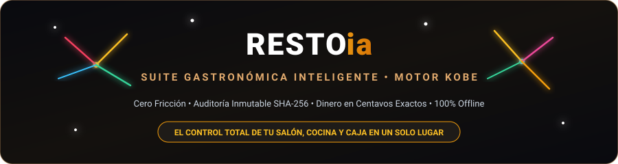
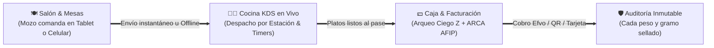

<div align="center">



<br/>

[](https://github.com/ExeDevCentral/RESTOai)
[](https://github.com/ExeDevCentral/RESTOai)
[](https://github.com/ExeDevCentral/RESTOai)
[](https://github.com/ExeDevCentral/RESTOai)

</div>

---

## 🎯 ¿Para quién es RESTOia?

**RESTOia** está diseñado para transformar la operación caótica de:

* 🍷 **Restaurantes de Alta Cocina y Bistrós**: Que exigen control milimétrico de tiempos de cocción, maridaje por IA y elegancia en salón.
* 🍔 **Cadenas Gastronómicas y Franquicias**: Con múltiples puntos de venta, turnos rotativos y auditoría anti-fraude.
* 🍺 **Bares, Cervecerías y Cafeterías de Alto Despacho**: Donde un mozo necesita mandar 20 pedidos por minuto sin que se caiga el sistema si se corta internet.
* 👨‍🍳 **Jefes de Cocina y Gerentes Operativos**: Cansados de perder mercadería por vencimientos o de sufrir descuadres de caja a las 2 AM.

---

## 💥 ¿Cómo Funciona? (Sin vueltas técnicas)



### 🌟 Los 5 Pilares que Enamoran al Restaurador:

1. **🗺️ Salón & Mesas Visual (POS Dinámico)**:
   - Visualizá tu salón real: mesas ocupadas, libres, reservadas y cuentas pedidas en tiempo real con alertas de color.
2. **👨‍🍳 Cocina Inteligente (KDS en Vivo)**:
   - Pantalla de comandas para los cocineros con cronómetros por plato. Alertas visuales automáticas si una mesa supera los 20 minutos de espera.
3. **📡 Modo Offline Imparable**:
   - ¿Se cayó el WiFi? ¿Cortaron la luz en el salón? **Los mozos siguen tomando comandas**. El sistema las encola en el dispositivo y las sincroniza solas apenas regresa la señal, sin duplicar pedidos jamás.
4. **💵 Caja Fuerte & Arqueo Ciego Z**:
   - El cajero cuenta el dinero físico sin saber cuánto dice el sistema. Cero manipulación. Cierre de caja blindado con PIN de supervisor para anular o hacer descuentos.
5. **📦 Stock FEFO & Alerta de Mermas**:
   - Lo que vence primero, se cocina primero (*First Expired, First Out*). Escaneo de código de barras para recepción de proveedores al instante.

---

## 🚀 Puesta en Marcha en 30 Segundos

```bash
# 1. Clonar el repositorio
git clone https://github.com/ExeDevCentral/RESTOai.git
cd RESTOai

# 2. Instalar dependencias
npm install

# 3. Iniciar la Suite
npm start
```

Abrí tu navegador en **`http://localhost:3000`** y disfrutá de la experiencia gastronómica definitiva. ✨

---

<div align="center">
  <sub>Desarrollado con pasión para la gastronomía de clase mundial &bull; Impulsado por el motor KOBE y metodologías Matt Pocock Skills.</sub>
</div>
