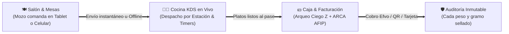

<div align="center">

<!-- FUEGOS ARTIFICIALES & BANNER HERO ANIMADO SVG -->
<svg viewBox="0 0 900 240" width="100%" height="240" xmlns="http://www.w3.org/2000/svg">
  <defs>
    <!-- Gradiente de Fondo Oscuro Lujoso -->
    <linearGradient id="bgGrad" x1="0%" y1="0%" x2="100%" y2="100%">
      <stop offset="0%" stop-color="#090a0f"/>
      <stop offset="50%" stop-color="#14110e"/>
      <stop offset="100%" stop-color="#090a0f"/>
    </linearGradient>

    <!-- Gradiente Dorado Brillante -->
    <linearGradient id="goldGrad" x1="0%" y1="0%" x2="100%" y2="0%">
      <stop offset="0%" stop-color="#f59e0b"/>
      <stop offset="50%" stop-color="#fbbf24"/>
      <stop offset="100%" stop-color="#d97706"/>
    </linearGradient>

    <!-- Resplandor / Glow Filter -->
    <filter id="glow" x="-20%" y="-20%" width="140%" height="140%">
      <feGaussianBlur stdDeviation="4" result="blur" />
      <feMerge>
        <feMergeNode in="blur" />
        <feMergeNode in="SourceGraphic" />
      </feMerge>
    </filter>

    <filter id="sparkleGlow" x="-30%" y="-30%" width="160%" height="160%">
      <feGaussianBlur stdDeviation="6" result="blur" />
      <feMerge>
        <feMergeNode in="blur" />
        <feMergeNode in="SourceGraphic" />
      </feMerge>
    </filter>
  </defs>

  <!-- Fondo -->
  <rect width="900" height="240" rx="18" fill="url(#bgGrad)" stroke="#e0a96d" stroke-width="1.5" stroke-opacity="0.3"/>

  <!-- FUEGOS ARTIFICIALES IZQUIERDA -->
  <g transform="translate(140, 90)">
    <circle cx="0" cy="0" r="3" fill="#fbbf24" filter="url(#glow)">
      <animate attributeName="r" values="2;5;2" dur="2s" repeatCount="indefinite"/>
      <animate attributeName="opacity" values="0.5;1;0.5" dur="2s" repeatCount="indefinite"/>
    </circle>
    <!-- Chispas radiales -->
    <line x1="0" y1="0" x2="-45" y2="-40" stroke="#f43f5e" stroke-width="2" stroke-linecap="round" filter="url(#glow)">
      <animate attributeName="stroke-dasharray" values="0,50; 50,0; 0,50" dur="2.4s" repeatCount="indefinite"/>
    </line>
    <line x1="0" y1="0" x2="45" y2="-45" stroke="#fbbf24" stroke-width="2" stroke-linecap="round" filter="url(#glow)">
      <animate attributeName="stroke-dasharray" values="0,50; 50,0; 0,50" dur="2.1s" repeatCount="indefinite"/>
    </line>
    <line x1="0" y1="0" x2="-55" y2="20" stroke="#38bdf8" stroke-width="1.8" stroke-linecap="round" filter="url(#glow)">
      <animate attributeName="stroke-dasharray" values="0,50; 50,0; 0,50" dur="2.7s" repeatCount="indefinite"/>
    </line>
    <line x1="0" y1="0" x2="50" y2="30" stroke="#34d399" stroke-width="2" stroke-linecap="round" filter="url(#glow)">
      <animate attributeName="stroke-dasharray" values="0,50; 50,0; 0,50" dur="2.3s" repeatCount="indefinite"/>
    </line>
    <line x1="0" y1="0" x2="0" y2="-60" stroke="#a855f7" stroke-width="2.2" stroke-linecap="round" filter="url(#glow)">
      <animate attributeName="stroke-dasharray" values="0,60; 60,0; 0,60" dur="1.9s" repeatCount="indefinite"/>
    </line>
  </g>

  <!-- FUEGOS ARTIFICIALES DERECHA -->
  <g transform="translate(760, 85)">
    <circle cx="0" cy="0" r="3" fill="#38bdf8" filter="url(#glow)">
      <animate attributeName="r" values="3;6;3" dur="2.2s" repeatCount="indefinite"/>
      <animate attributeName="opacity" values="0.6;1;0.6" dur="2.2s" repeatCount="indefinite"/>
    </circle>
    <line x1="0" y1="0" x2="-40" y2="-45" stroke="#fbbf24" stroke-width="2" stroke-linecap="round" filter="url(#glow)">
      <animate attributeName="stroke-dasharray" values="0,50; 50,0; 0,50" dur="2.5s" repeatCount="indefinite"/>
    </line>
    <line x1="0" y1="0" x2="45" y2="-35" stroke="#ec4899" stroke-width="2" stroke-linecap="round" filter="url(#glow)">
      <animate attributeName="stroke-dasharray" values="0,50; 50,0; 0,50" dur="2s" repeatCount="indefinite"/>
    </line>
    <line x1="0" y1="0" x2="-50" y2="25" stroke="#34d399" stroke-width="1.8" stroke-linecap="round" filter="url(#glow)">
      <animate attributeName="stroke-dasharray" values="0,50; 50,0; 0,50" dur="2.8s" repeatCount="indefinite"/>
    </line>
    <line x1="0" y1="0" x2="40" y2="40" stroke="#f59e0b" stroke-width="2" stroke-linecap="round" filter="url(#glow)">
      <animate attributeName="stroke-dasharray" values="0,50; 50,0; 0,50" dur="2.2s" repeatCount="indefinite"/>
    </line>
    <line x1="0" y1="0" x2="0" y2="-55" stroke="#6366f1" stroke-width="2.2" stroke-linecap="round" filter="url(#glow)">
      <animate attributeName="stroke-dasharray" values="0,55; 55,0; 0,55" dur="1.8s" repeatCount="indefinite"/>
    </line>
  </g>

  <!-- DESTELLOS DE LUZ / ESTRELLAS TITILANTES -->
  <g fill="#fff" filter="url(#sparkleGlow)">
    <circle cx="80" cy="40" r="1.5">
      <animate attributeName="opacity" values="0.2;1;0.2" dur="1.5s" repeatCount="indefinite"/>
    </circle>
    <circle cx="280" cy="30" r="2">
      <animate attributeName="opacity" values="0.1;0.9;0.1" dur="2.2s" repeatCount="indefinite"/>
    </circle>
    <circle cx="620" cy="35" r="2.5">
      <animate attributeName="opacity" values="0.2;1;0.2" dur="1.8s" repeatCount="indefinite"/>
    </circle>
    <circle cx="820" cy="180" r="1.8">
      <animate attributeName="opacity" values="0.3;1;0.3" dur="2.6s" repeatCount="indefinite"/>
    </circle>
    <circle cx="110" cy="190" r="2">
      <animate attributeName="opacity" values="0.1;1;0.1" dur="1.9s" repeatCount="indefinite"/>
    </circle>
  </g>

  <!-- TÍTULO PRINCIPAL CON EFECTO NEÓN / GLOW -->
  <text x="450" y="85" text-anchor="middle" font-family="'Outfit', 'Plus Jakarta Sans', system-ui, sans-serif" font-weight="900" font-size="44" fill="#ffffff" letter-spacing="2">
    RESTO<tspan fill="url(#goldGrad)" filter="url(#sparkleGlow)">ia</tspan>
  </text>

  <!-- SUBTÍTULO CON LUZ Y ESTILO CINEMATOGRÁFICO -->
  <text x="450" y="125" text-anchor="middle" font-family="'Outfit', 'Plus Jakarta Sans', system-ui, sans-serif" font-weight="600" font-size="16" fill="#e0a96d" letter-spacing="3">
    ✨ SUITE GASTRONÓMICA INTELIGENTE &bull; KOBE ENGINE ✨
  </text>

  <!-- BADGES Y DESTACADOS ILUMINADOS -->
  <text x="450" y="165" text-anchor="middle" font-family="'Plus Jakarta Sans', system-ui, sans-serif" font-size="13" fill="#cbd5e1">
    🚀 Cero Fricción &bull; 🛡️ Auditoría Inmutable SHA-256 &bull; 💵 Dinero en Centavos Exactos &bull; 📡 100% Offline
  </text>

  <rect x="250" y="185" width="400" height="28" rx="14" fill="#1e1b18" stroke="#f59e0b" stroke-width="1"/>
  <text x="450" y="204" text-anchor="middle" font-family="'Plus Jakarta Sans', system-ui, sans-serif" font-weight="700" font-size="12" fill="#fbbf24">
    ⚡ EL CONTROL TOTAL DE TU SALÓN, COCINA Y CAJA EN UN SOLO LUGAR ⚡
  </text>
</svg>

<br/>

[](https://github.com/ExeDevCentral/RESTOai)
[](https://github.com/ExeDevCentral/RESTOai)
[](https://github.com/ExeDevCentral/RESTOai)
[](https://github.com/ExeDevCentral/RESTOai)

</div>

---

## 🎯 ¿Para quién es RESTOia?

**RESTOia** está diseñado para transformar la operación caótica de:

* 🍷 **Restaurantes de Alta Cocina y Bistrós**: Que exigen control milimétrico de tiempos de cocción, maridaje por IA y elegancia en salón.
* 🍔 **Cadenas Gastronómicas y Franquicias**: Con múltiples puntos de venta, turnos rotativos y auditoría anti-fraude.
* 🍺 **Bares, Cervecerías y Cafeterías de Alto Despacho**: Donde un mozo necesita mandar 20 pedidos por minuto sin que se caiga el sistema si se corta internet.
* 👨‍🍳 **Jefes de Cocina y Gerentes Operativos**: Cansados de perder mercadería por vencimientos o de sufrir descuadres de caja a las 2 AM.

---

## 💥 ¿Cómo Funciona? (Sin vueltas técnicas)



### 🌟 Los 5 Pilares que Enamoran al Restaurador:

1. **🗺️ Salón & Mesas Visual (POS Dinámico)**:
   - Visualizá tu salón real: mesas ocupadas, libres, reservadas y cuentas pedidas en tiempo real con alertas de color.
2. **👨‍🍳 Cocina Inteligente (KDS en Vivo)**:
   - Pantalla de comandas para los cocineros con cronómetros por plato. Alertas visuales automáticas si una mesa supera los 20 minutos de espera.
3. **📡 Modo Offline Imparable**:
   - ¿Se cayó el WiFi? ¿Cortaron la luz en el salón? **Los mozos siguen tomando comandas**. El sistema las encola en el dispositivo y las sincroniza solas apenas regresa la señal, sin duplicar pedidos jamás.
4. **💵 Caja Fuerte & Arqueo Ciego Z**:
   - El cajero cuenta el dinero físico sin saber cuánto dice el sistema. Cero manipulación. Cierre de caja blindado con PIN de supervisor para anular o hacer descuentos.
5. **📦 Stock FEFO & Alerta de Mermas**:
   - Lo que vence primero, se cocina primero (*First Expired, First Out*). Escaneo de código de barras para recepción de proveedores al instante.

---

## 🚀 Puesta en Marcha en 30 Segundos

```bash
# 1. Clonar el repositorio
git clone https://github.com/ExeDevCentral/RESTOai.git
cd RESTOai

# 2. Instalar dependencias
npm install

# 3. Iniciar la Suite
npm start
```

Abrí tu navegador en **`http://localhost:3000`** y disfrutá de la experiencia gastronómica definitiva. ✨

---

<div align="center">
  <sub>Desarrollado con pasión para la gastronomía de clase mundial &bull; Impulsado por el motor KOBE y metodologías Matt Pocock Skills.</sub>
</div>
